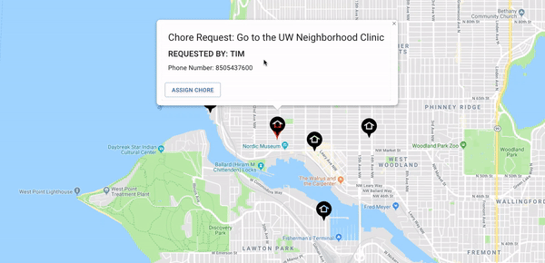

# Helping Hands

A MERN Full stack program that connects home bound people with caring neighbors to help them do chores and errands.

Link to application: [Heroku Deploy](https://helping-hands-2.herokuapp.com/)

## Home Page

## Getting Started

 - Clone Repo
 - npm install at the root of the folder
 - Insert your own MongoDB access for MONGODB_URI
 - run npm start at root

## Technologies Utilized

 - React.JS
 - Material-UI
 - MongoDB Atlas
 - React-Google-Maps NPM Package
 - JWTTokens(For authentication)
 - Express.JS
 - Scaledrone

## Collaborators and Responsibilities

 - Kelsey Beffel - Authentication and Profiles(Future deployment)
 - Tad Ochwat - Chat Features, Chore list, Styling
 - Andrew Rice - Google Maps, Deployment, Styling, Chore List